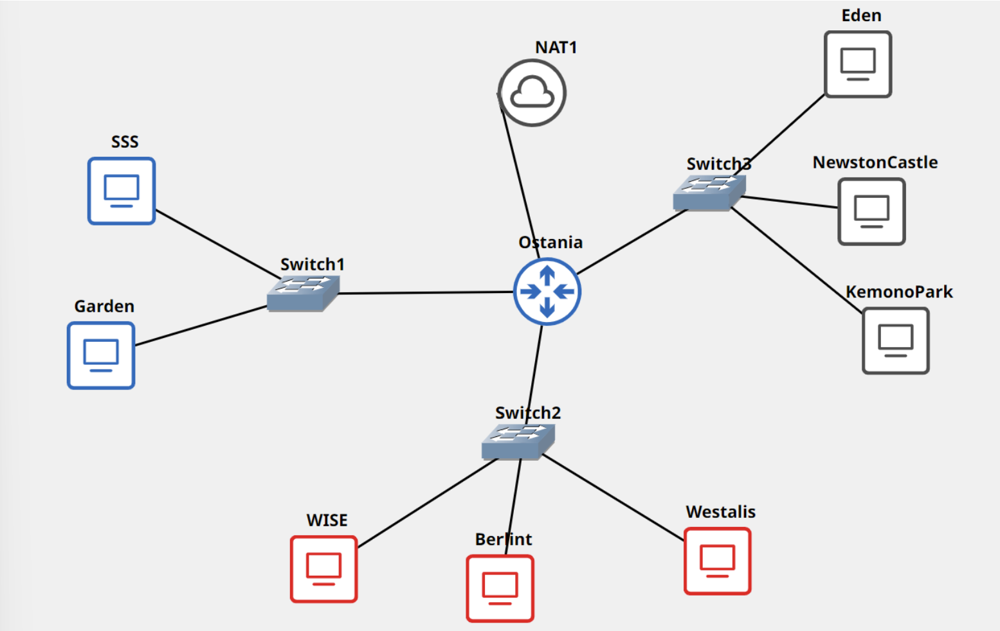

# Jarkom-Modul-3-B08-2022

## Anggota Kelompok
<table>
 	<tr>
 		<td> Nama </td>
 		<td> NRP</td>
 	</tr>
 	<tr>
 		<td> Aaliyah Farah Adibah </td>
 		<td> 5025201070 </td>
 	</tr>
  <tr>
 		<td> Rafael Asi Kristanto Tambunan </td>
 		<td> 5025201168 </td>
 	</tr>
  <tr>
 		<td> Sejati Bakti Raga </td>
 		<td> 5025201007 </td>
 	</tr>
 </table>
 
 ## Daftar Isi
  + [Soal 1](#soal-1)
  + [Soal 2](#soal-2)
  + [Soal 3](#soal-3)
  + [Soal 4](#soal-4)
  + [Soal 5](#soal-5)
  + [Soal 6](#soal-6)
  + [Soal 7](#soal-7)
  + [Soal 8](#soal-8)
  + [Soal 9](#soal-9)
  + [Soal 10](#soal-10)
  + [Soal 11](#soal-11)
  + [Soal 12](#soal-12)
  + [Kendala](#kendala)
  
## Soal 1
 
 
 ***Loid bersama Franky berencana membuat peta tersebut dengan kriteria WISE sebagai DNS Server, 
 Westalis sebagai DHCP Server, Berlint sebagai Proxy Server (1)***<br><br>
 
 Pertama-tama, buat topologinya terlebih dahulu.
 
 
 Lalu konfigurasi setiap nodenya<br>
 
 **Foosha**   
 
```
auto eth0
iface eth0 inet dhcp
auto eth1
  iface eth1 inet static
	 address 10.7.1.1
	 netmask 255.255.255.0
 
 auto eth2
 iface eth2 inet static
	  address 10.7.2.1
	  netmask 255.255.255.0
 
 auto eth3
 iface eth3 inet static
   address 10.7.3.1
	  netmask 255.255.255.0
 ```
 
 **SSS**
 
 ```
 auto eth0
 iface eth0 inet dhcp
 ```
 
 **Garden**
 
 ```
 auto eth0
 iface eth0 inet dhcp
 ```
 
 **WISE**
 
 ```
 auto eth0
 iface eth0 inet static
	  address 10.7.2.2
	  netmask 255.255.255.0
	  gateway 10.7.2.1
 ```
 
 **Berlint**
 
 ```
 auto eth0
 iface eth0 inet static
	  address 10.7.2.3
	  netmask 255.255.255.0
	  gateway 10.7.2.1
 ```
 
  **Westalis**
 
 ```
 auto eth0
 iface eth0 inet static
	  address 10.7.2.4
	  netmask 255.255.255.0
	  gateway 10.7.2.1
 ```
 
  **Eden**
 
 ```
 auto eth0
 iface eth0 inet dhcp
	  hwaddress ether 
 ```
 
 **NewstonCastle**
 
 ```
 auto eth0
 iface eth0 inet static
	  address 10.7.3.3
	  netmask 255.255.255.0
	  gateway 10.7.3.1
  ```
  
  **KemonoPark**
 
 ```
 auto eth0
 iface eth0 inet static
	  address 10.7.3.4
	  netmask 255.255.255.0
	  gateway 10.7.3.1
  ```
 
 Buat node sesuai dengan kriterianya:<br>
 
 WISE -> DNS Server 
 
 ```
echo "nameserver 192.168.122.1" > /etc/resolv.conf
apt-get update
apt-get install bind9 -y
 ```
 
 Westalis -> DHCP Server
 
 ```
echo "nameserver 192.168.122.1" > /etc/resolv.conf
apt-get update
apt-get install isc-dhcp-server -y
 ```
 
  Berlint -> Proxy Server
 ```
echo "nameserver 192.168.122.1" > /etc/resolv.conf
apt-get update
apt-get install libapache2-mod-php7.0 -y
apt-get install squid -y
 ```
 
 **TESTING**
 
   
## Soal 2

***dan Ostania sebagai DHCP Relay (2). Loid dan Franky menyusun peta tersebut 
dengan hati-hati dan teliti***<br><br> 

Ostania -> DHCP Relay 

```
apt-get update
apt-get install isc-dhcp-relay -y
```

 **TESTING**
 

## Soal 3

***Ada beberapa kriteria yang ingin dibuat oleh Loid dan Franky, yaitu:***

***1. Semua client yang ada HARUS menggunakan konfigurasi IP dari DHCP Server.***

***2. Client yang melalui Switch1 mendapatkan range IP dari [prefix IP].1.50 - [prefix IP].1.88 
dan [prefix IP].1.120 - [prefix IP].1.155 (3)*** <br><br> 

Pertama konfigurasi DHCP Relay pada Ostania <br>
Lakukan konfigurasi pada Ostania dengan melakukan edit file /etc/default/isc-dhcp-relay dengan konfigurasi berikut:

```
# Defaults for isc-dhcp-relay initscript
# sourced by /etc/init.d/isc-dhcp-relay
# installed at /etc/default/isc-dhcp-relay by the maintainer scripts

#
# This is a POSIX shell fragment
#

# What servers should the DHCP relay forward requests to?
SERVERS="10.45.2.4"

# On what interfaces should the DHCP relay (dhrelay) serve DHCP requests?
INTERFACES="eth1 eth3 eth2"

# Additional options that are passed to the DHCP relay daemon?
OPTIONS=""
```

Lalu konfigurasi DHCP Server pada Westalis<br>

Membuat Westalis menjadi DHCP Server. Karena Westais Terhubung dengan Ostania melalui eth0 sehingga lakukan konfigurasi pada file /etc/default/isc-dhcp-server sebagai berikut:

```
# Defaults for isc-dhcp-server initscript
# sourced by /etc/init.d/isc-dhcp-server
# installed at /etc/default/isc-dhcp-server by the maintainer scripts

#
# This is a POSIX shell fragment
#

# Path to dhcpd's config file (default: /etc/dhcp/dhcpd.conf).
#DHCPD_CONF=/etc/dhcp/dhcpd.conf

# Path to dhcpd's PID file (default: /var/run/dhcpd.pid).
#DHCPD_PID=/var/run/dhcpd.pid

# Additional options to start dhcpd with.
#       Don't use options -cf or -pf here; use DHCPD_CONF/ DHCPD_PID instead
#OPTIONS=""

# On what interfaces should the DHCP server (dhcpd) serve DHCP requests?
#       Separate multiple interfaces with spaces, e.g. "eth0 eth1".
INTERFACES="eth0"
```

Setelah itu, lakukan restart DHCP Server di Westalis

```
service isc-dhcp-server restart
```

Lakukan konfigurasi di DHCP Server untuk rentang IP yang akan diberikan pada file /etc/dhcp/dhcpd.conf dengan cara:

```
subnet 10.7.2.0 netmask 255.255.255.0 {
}
subnet 10.7.1.0 netmask 255.255.255.0 {
    range  10.7.1.50 10.7.1.88;
    range  10.7.1.120 10.7.1.155;
    option routers 10.7.1.1;
    option broadcast-address 10.7.1.255;
    option domain-name-servers 10.7.2.2;
    default-lease-time 300;
    max-lease-time 6900;
}
```

 **TESTING**
 

## Soal 4

***3. Client yang melalui Switch3 mendapatkan range IP dari [prefix IP].3.10 - [prefix IP].3.30 
dan [prefix IP].3.60 - [prefix IP].3.85 (4)***<br><br> 

Lakukan konfigurasi di DHCP Server untuk rentang IP yang akan diberikan pada file /etc/dhcp/dhcpd.conf dengan cara menambahkan:

```
subnet 10.7.3.0 netmask 255.255.255.0 {
}
subnet 10.7.3.0 netmask 255.255.255.0 {
    range  10.7.3.10 10.7.3.30;
    range  10.7.3.60 10.7.3.85;
    option routers 10.7.3.1;
    option broadcast-address 10.7.3.255;
    option domain-name-servers 10.7.2.2;
    default-lease-time 600;
    max-lease-time 6900;
}
```

 **TESTING**
 

## Soal 5

***4. Client mendapatkan DNS dari WISE dan client dapat terhubung dengan internet melalui DNS 
tersebut (5)***<br><br>

Untuk client mendapatkan DNS dari WISE diperlukan konfigurasi pada file /etc/dhcp/dhcpd.conf dengan option domain-name-servers 10.45.2.2

Supaya semua client dapat terhubung internet pada WISE diberikan konfigurasi pada file /etc/bind/named.conf.options dengan

```
options {
        directory \"/var/cache/bind\";

        forwarders {
                8.8.8.8;
                8.8.8.4;
        };

        // dnssec-validation auto;
        allow-query { any; };
        auth-nxdomain no;    # conform to RFC1035
        listen-on-v6 { any; };
};
```

 **TESTING**
 

## Soal 6

***5. Lama waktu DHCP server meminjamkan alamat IP kepada Client yang melalui Switch1 selama 
5 menit sedangkan pada client yang melalui Switch3 selama 10 menit. Dengan waktu maksimal 
yang dialokasikan untuk peminjaman alamat IP selama 115 menit. (6)***<br><br>

Pada subnet interface switch 1 dan 3 ditambahkan konfigurasi berikut pada file `/etc/dhcp/dhcpd.conf`

```
subnet 10.7.1.0 netmask 255.255.255.0 {
    ...
    default-lease-time 300; 
    max-lease-time 6900;
    ...
}
subnet 10.7.3.0 netmask 255.255.255.0 {
    ...
    default-lease-time 600;
    max-lease-time 6900;
    ...
}
```

 **TESTING**
 

## Soal 7

***Loid dan Franky berencana menjadikan Eden sebagai server untuk pertukaran informasi 
dengan alamat IP yang tetap dengan IP [prefix IP].3.13 (7)***<br><br>

Menambahkan konfigurasi untuk fixed address pada `/etc/dhcp/dhcpd.conf`

```
host Eden {
    hardware ethernet be:c0:ff:37:bb:09;
    fixed-address 10.7.3.13;
}
```
Setelah itu tidak lupa untuk mengganti konfigurasi pada file `/etc/network/interfaces` dengan
```
auto eth0
iface eth0 inet dhcp
hwaddress ether be:c0:ff:37:bb:09
```

 **TESTING**
 

## Soal 8

***SSS, Garden, dan Eden digunakan sebagai client Proxy agar pertukaran informasi dapat terjamin
keamanannya, juga untuk mencegah kebocoran data. Pada Proxy Server di Berlint, Loid berencana 
untuk mengatur bagaimana Client dapat mengakses internet. Artinya setiap client harus menggunakan 
Berlint sebagai HTTP & HTTPS proxy. Adapun kriteria pengaturannya adalah sebagai berikut:***

***1. Client hanya dapat mengakses internet diluar (selain) hari & jam kerja 
(senin-jumat 08.00 - 17.00) dan hari libur (dapat mengakses 24 jam penuh)***<br><br>

 **TESTING**
 

## Soal 9

***2. Adapun pada hari dan jam kerja sesuai nomor (1), client hanya dapat mengakses 
domain loid-work.com dan franky-work.com (IP tujuan domain dibebaskan)***<br><br>

 **TESTING**
 

## Soal 10

***3. Saat akses internet dibuka, client dilarang untuk mengakses web tanpa HTTPS. 
(Contoh web HTTP: http://example.com)***<br><br>

 **TESTING**
 

## Soal 11

***4. Agar menghemat penggunaan, akses internet dibatasi dengan kecepatan maksimum 128 Kbps 
pada setiap host (Kbps = kilobit per second; lakukan pengecekan pada tiap host, ketika 2 host 
akses internet pada saat bersamaan, keduanya mendapatkan speed maksimal yaitu 128 Kbps)***<br><br>

 **TESTING**
 

## Soal 12

***5. Setelah diterapkan, ternyata peraturan nomor (4) mengganggu produktifitas saat hari kerja, 
dengan demikian pembatasan kecepatan hanya diberlakukan untuk pengaksesan internet pada
hari libur***<br><br>

 **TESTING**
 

## Kendala
+ Aaliyah Farah Adibah<br>
    	1. Hanya bisa mengerjakan hingga no. 7 
    	2. GNS yang mudah error
    	3. Sempat fail di restart DHCP Server hingga perlu run semua node dari awal
	
+ Rafael Asi Kristanto Tambunan
	1. Penggunaan GNS yang masih baru
	2. GNS yang sering error saat digunakan

+ Sejati Bakti Raga
	1. Pemahaman GNS yang masih kurang
	2. GNS dan VM error ditengah pengerjaan


